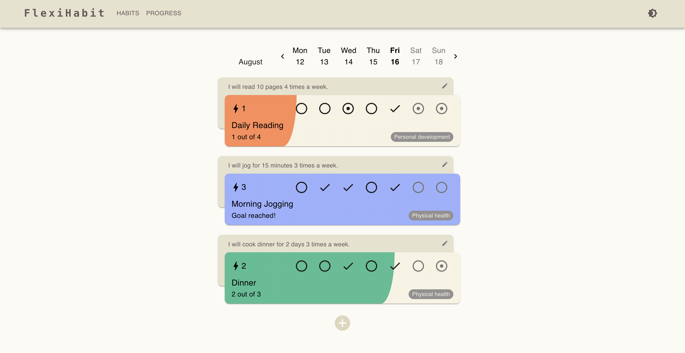
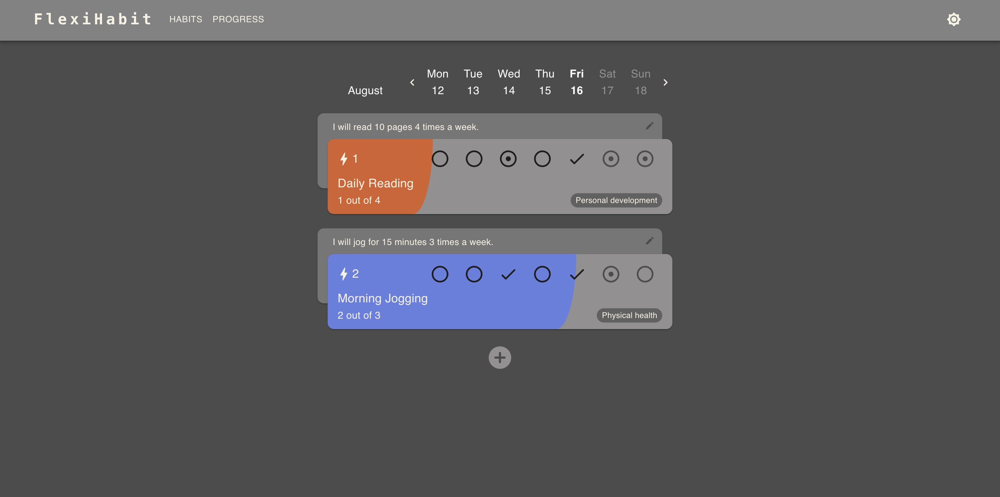
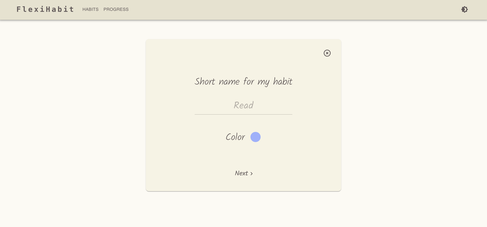
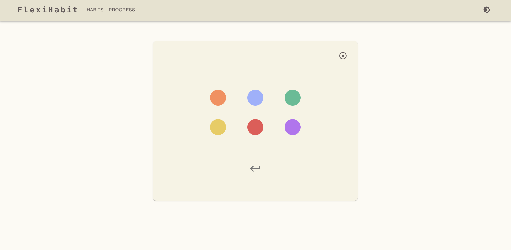
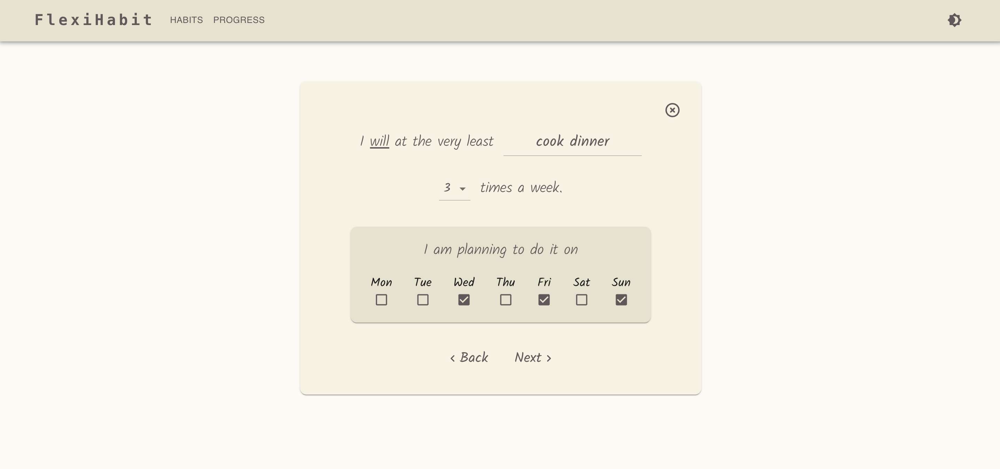
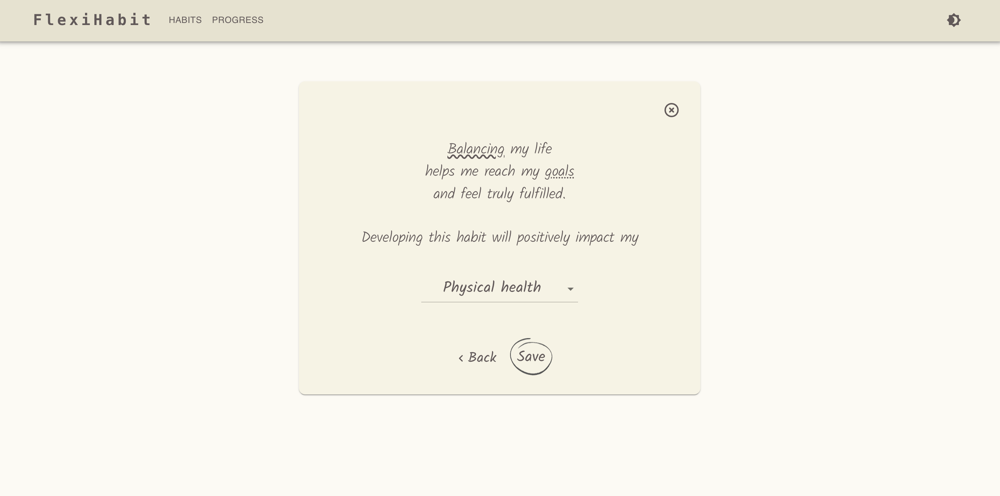
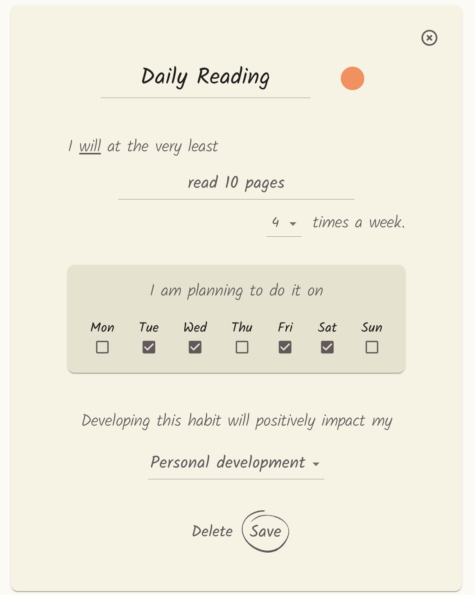

# FlexiHabit (habit-tracker)

FlexiHabit is designed to help users develop and maintain good habits by providing a clear and customizable interface to track daily progress. Users can set goals, monitor their progress, and adjust their targets to fit their schedules.

FlexiHabit is a comprehensive habit tracking web application that was designed and implemented from scratch using React, TypeScript, Material UI, and MongoDB. The project features a clear separation between frontend and backend, utilizing React Router for a seamless multipage experience. 

Features
- Habit List with Weekly Calendar: Track habits with a calendar view for the current week, allowing users to mark completed days.
- Customizable Target Days: Set and adjust target days to achieve weekly goals and maintain habit streaks.
- Navigation: Navigate between past and future weeks to monitor progress over time.
- Progression Bar: Visualize weekly habit completion with a progression bar.
- Minimum Weekly Goal Statements: Encourage consistency with personalized goal statements for each habit.

Technologies Used
- Frontend: React, TypeScript, Material UI
- Backend: TypeScript, Node.js, Express.js, MongoDB
- Routing: React Router

### Dashboard:

### Dashboard in dark mode:

### Creating new habit:

### Editing a habit:

